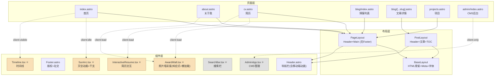

# Harry Yu 个人博客 — 项目知识图谱

> 生成时间：2026-06-18 (最后更新: 新增友链页 + cms 友链管理;AgenticRL/GRPO 博客文章)
> 项目：`alidadei.github.io` | Astro 6 + React 19 + Tailwind CSS 4

---

## 1. 整体架构

```
用户浏览器
    │
    ▼
┌─────────────────────────────────────────────┐
│  GitHub Pages (静态部署)                      │
│  alidadei.github.io                          │
│                                              │
│  ┌──────────────────────────────────────┐    │
│  │  Astro SSG 构建产物                    │    │
│  │  - HTML 页面 (.html)                  │    │
│  │  - CSS / JS bundles                   │    │
│  │  - 图片等静态资源                      │    │
│  └──────────────────────────────────────┘    │
└─────────────────────────────────────────────┘
         ▲                    ▲
         │ 构建               │ API
┌────────┴──────┐   ┌────────┴────────────┐
│ GitHub Actions │   │ Cloudflare Worker   │
│ CI/CD Pipeline │   │ (CMS 后端 API)      │
│ deploy.yml     │   │ yhl-blog-cms        │
└───────────────┘   └─────────────────────┘
                            │
                            ▼
                     GitHub Contents API
                     (OAuth 鉴权 + KV 会话)
```

---

## 2. 技术栈

| 层级 | 技术 | 版本 |
|------|------|------|
| **框架** | Astro | ^6.1.3 |
| **交互组件** | React | ^19.2.4 |
| **样式** | Tailwind CSS | ^4.2.2 |
| **Markdown** | MDX + remark-math + rehype-katex | — |
| **农历库** | lunar-javascript | ^1.7.7 |
| **3D图形** | Three.js (自托管) | vendor/three/ |
| **构建工具** | Vite (Astro 内置) | — |
| **部署** | GitHub Pages (Actions) | — |
| **CMS 后端** | Cloudflare Worker + KV | — |
| **Node** | >= 22.12.0 | — |

---

## 3. 页面路由图

```
/ (根路径)
 └─→ 重定向 /zh/

/rss.xml                    RSS 订阅源

/[lang]/                    首页 (SunArc天空+3D背景+最新文章)
/[lang]/about/              关于我 (双栏布局;内容由 content/about/*.md 维护;含AwardWall彩蛋)
/[lang]/cv/                 简历 (折叠面板，旧版保留)
/[lang]/projects/           项目展示
/[lang]/links/              友链 (玻璃质感卡片网格,数据驱动 friends.json)
/[lang]/blog/               博客列表 (时间线 + 分类 + 搜索)
/[lang]/blog/[slug]/        博客文章详情 (TOC侧边栏 + 面包屑)
/[lang]/blog/category/[..]/ 分类页
/[lang]/admin/              CMS 管理后台 (noindex)
```

**语言前缀**：`/zh/` 中文 (默认) | `/en/` 英文

---

## 4. 组件依赖关系



> ⚛ = React 组件 (需要 client: 指令水合)
> 其余为 Astro 组件 (静态渲染，0 JS)

---

## 5. 数据流

```
┌───────────────────────────────────────────────────────┐
│  数据源                                                │
│                                                        │
│  src/data/                                             │
│  ├── site.ts          站点配置 (作者/导航/社交链接)       │
│  ├── categories.json  分类树 (3顶级 + 子分类)            │
│  ├── categories.ts    分类工具函数
│  ├── redirects.json   分类旧URL→新URL重定向 (cms改名时自动生成)                       │
│  └── quotes.json      每日一句 (中英各10条)               │
│                                                        │
│  src/content/                                          │
│  ├── posts/zh/        10篇博客文章 (Markdown)            │
│  ├── portfolio/       2个作品集项目                      │
│  └── about/           关于我 (zh.md/en.md, Markdown)                       │
│                                                        │
│  src/i18n/                                             │
│  ├── ui.ts            UI翻译字典 (38 key × 2语言)       │
│  └── (lib/i18n.ts)    路由工具函数                       │
│                                                        │
│  public/images/       ~60+张图片素材                     │
└───────────────────────────────────────────────────────┘
                    │
                    ▼  Astro 构建时注入
┌───────────────────────────────────────────────────────┐
│  页面组件 (Astro frontmatter)                           │
│                                                        │
│  getCollection('posts')  ──→  文章列表/排序/过滤         │
│  getCollection('about')   ──→ 关于我内容 (zh/en md)                 │
│  import siteConfig      ──→  导航/作者信息              │
│  import categories.json ──→  分类树渲染                 │
│  import quotes.json     ──→  每日一句数据               │
│  getUI(lang, key)       ──→  界面文字翻译               │
└───────────────────────────────────────────────────────┘
                    │
                    ▼  静态生成 HTML
┌───────────────────────────────────────────────────────┐
│  dist/                                                 │
│  HTML页面 + CSS/JS bundles + 静态资源                    │
└───────────────────────────────────────────────────────┘
```

---

## 6. 内容集合 Schema

### posts (博客文章)
```
title: string          文章标题
description?: string   摘要描述
date: Date             发布日期 (兼作 maturity 的时间锚)
updated?: Date         更新日期
tags: string[]         标签列表
categories?: string[]  分类路径 (如 ["note", "ai"]);第 0 段 = origin 产出方式
category?: string      旧版分类 (兼容)
knowledge?: string[]   知识主题路径 subject (存 knowledge.json 的 slug, 如 ["ai/llm/rl"]);构建时强校验必须存在
maturity?: 基础|当下热点|未来展望  时效定位 (锚在 date)
image?: string         封面图
draft?: boolean        草稿 (默认 false)
lang: zh | en          语言 (默认 zh)
```

> **写作规范：** 标题只在 frontmatter 的 `title` 字段中声明，PostLayout 会自动渲染为页面 H1。正文内容从 `##` (h2) 开始写，**不要在正文中写 `# 标题`**，否则会与页面标题重复。

### about (关于我) — 内容集合,只改 .md 即可更新页面 (commit 9063300)
```
lang: zh | en              语言 (zh.md / en.md)
news: [{date, text}]       近期动态
education: [{school, period, degree}]
internship: [{company, period, description}]
research: [{title, role?, period?, description}]
awards: [{title, desc?}]   desc 可省略
skills: [{name, items: string[]}]
+ Markdown 正文             自我介绍 → 渲染到页面顶部 .prose 区
```
> 所有板块可选,省略则整块(含标题)隐藏。
> 布局:桌面端左栏(头像🎻+联系方式 sticky)+ 右栏内容;手机端顶部紧凑小卡片。
> 邮箱/GitHub/位置统一读 site.ts author 字段。

### portfolio (作品集) — 分类 + 缩略图 + 无限滚动 (commit 00377fb)
```
title: string          标题
excerpt?: string       摘要
image?: string         缩略图原图 (/images/xxx.png → sharp 压成 webp)
link?: string          详情外链 (独立 HTML 或外链)
categories?: string[]  分类标签 (前端自动聚合成 tabs)
```
> projects.astro: 分类 tabs(自定义标签动态聚合)+ sharp 压缩缩略图卡片 + 无限滚动(每批6, IntersectionObserver)。
> 缩略图: `scripts/gen-portfolio-thumbs.mjs`(sharp)→ `public/images/thumbs/*.webp`(gitignore),`npm run thumbs`/build/CI 自动生成。
> 详情页: 独立 HTML(`public/portfolio/*.html`),md 正文闲置。

---

## 7. 分类体系

```
博客分类树 (slug 即 URL 段,/zh/blog/category/<slug>/)
├── note (学习笔记)
│   ├── ai (AI)
│   │   └── transformer (Transformer)
│   ├── embedded (嵌入式开发)
│   └── data-structure (数据结构与算法)
├── practice (个人调研&实践)
└── insights (个人感悟)

> 旧 slug (tech-learning / deep-learning / personal-practice / personal-views) 已重命名;
> 旧 URL 通过 redirects.json 自动跳转到新 slug。
```

**知识三轴**(origin × subject × maturity,详见 `docs/知识架构分类.md`)——与上面的分类树正交、各管一摊:
- **origin** = `categories[0]`(note/practice)——产出方式,驱动时间线分类 tab。
- **subject** = `knowledge` 字段,路径取自 `src/data/knowledge.json` 主题树(存英文 slug,显示查表取中英 label,改名只改 label):
  ```
  ai ├─ llm ├─ rl (强化学习)
  │       └─ agent
     └─ nn-math (神经网络数学)
  programming ├─ data-structure / git
  electronics └─ embedded
  ```
- **maturity** = 基础 / 当下热点 / 未来展望,锚在 `date`(随时间不腐烂)。
- 博客页有**「时间线 / 知识树」双视图**(`src/pages/[lang]/blog/index.astro`):知识树按 subject 主题树横向展开 + maturity 透镜(基础/热点不同色点),`src/components/blog/KnowledgeNode.astro` 递归渲染,可折叠,localStorage 记住视图选择。
- 新文章用 `npm run new-post`(`scripts/new-post.mjs`)交互式生成三轴 frontmatter;`knowledge` 路径构建时强校验。

---

## 8. 样式系统

```
global.css
├── @import "tailwindcss"
├── @theme { 自定义颜色变量 }
│   ├── primary: #5b4636 (深棕)
│   ├── accent: #b07d4f (铜色)
│   ├── bg: #faf6f0 (米白)
│   ├── text: #3a2e24 (深棕文字)
│   └── border: #ddd2c2 (浅棕边框)
│
├── 基础排版 (body 字体/行高/平滑)
├── 动画 (.fade-in / .stagger-in)
├── 文章排版 (.prose h1-h4 / blockquote / table / code)
│   ├── img: max-width:100% + height:auto (防溢出)
│   └── table: display:block + overflow-x:auto (横向滚动)
├── 组件样式 (.post-card / .tag-chip / .toc-link)
├── 滚动条美化
└── prefers-reduced-motion 适配
```

**字体**：Inter (自托管 woff2) + Noto Sans SC (系统回退) + PingFang SC + Microsoft YaHei + Caveat (Google Fonts, 仅Logo)

---

## 9. CMS 后端架构

```
管理员浏览器
    │
    ▼
/admin/ 页面 (React SPA)
    │
    ▼  API 调用
Cloudflare Worker (yhl-blog-cms)
    │
    ├── /api/auth/login      → GitHub OAuth 授权
    ├── /api/auth/callback    → 换取 token + 创建 KV 会话
    ├── /api/posts            → CRUD 博客文章
    ├── /api/file/*           → 读写任意文件 (categories.json 等)
    ├── /api/images           → 上传/删除图片
    ├── /api/batch            → 批量操作 (GraphQL commit)
    ├── /api/deploy/status    → 查看 GitHub Actions 部署状态
    ├── /api/feed-proxy       → 友链 RSS 反代 (白名单, 绕过 CF 对 CI 数据中心 IP 的拦截)
    │
    ▼
GitHub Contents API
    │
    ▼  推送代码
GitHub Repository
    │
    ▼  触发
GitHub Actions → 构建 → 部署到 GitHub Pages
```

---

## 10. 客户端交互汇总

| 页面 | 交互 | 实现方式 |
|------|------|----------|
| 首页 | 天空动画 (实时太阳位置/日升日落) | React SunArc (client:idle)，太阳Y位置大幅提升避免遮挡3D物体 (移动端range 30%→2%, 桌面端range 40%→2%)，spacer无overflow:hidden防太阳截断；iframe架构导致太阳无法自然遮挡3D，因此通过抬高太阳位置解决 |
| 首页 | 干支日期3列竖排 (年/月/日, 天干+地支+标签, 五行配色) | React useState + flex布局，移动端 gap-0.5/left-1，桌面端 gap-3/left-4 (commit 288e0d9) |
| 首页 | 每日一句轮换 | Vanilla JS (fetch `/quotes.json` + 按日期取模) |
| 首页 | 3D背景场景 (warm-storybook风格) | Three.js iframe (桌面端含Bloom / 移动端跳过Bloom) |
| 博客列表 | 搜索过滤 | Vanilla JS (标题匹配) |
| 博客列表 | 分类标签切换 | Vanilla JS (DOM toggle) |
| 博客列表 | 搜索框展开/收起 | Vanilla JS (max-width transition) |
| 博客列表 | 时间线/知识树 双视图切换 (localStorage 记忆) | Vanilla JS (DOM toggle; 知识树按 subject 主题树展开 + maturity 透镜, KnowledgeNode.astro 递归渲染) |
| 博客列表 | RSS 复制订阅地址 (Ctrl/中键仍打开 feed) | Vanilla JS (clipboard + ✓ 反馈) |
| 友链页 | 友链卡片展示对方最新文章 (1 篇) | 构建时 fetch RSS (经 Worker /api/feed-proxy 反代绕过 CF) |
| 文章详情 | TOC 侧边栏生成 + 滚动追踪 | 桌面端: 固定侧栏 / 移动端: 右侧悬浮按钮+滑出面板 |
| 文章详情 | 平滑跳转 | Vanilla JS (getBoundingClientRect) |
| 文章详情 | 代码块一键复制按钮 | Vanilla JS (clipboard API + execCommand 回退);BaseLayout 注入,图标按钮,桌面 hover 显示/手机(@media hover:none)常显,点击变绿色 ✓ |
| 简历 | 折叠面板展开/收起 | Vanilla JS (max-height transition) |
| 简历 | 全部展开/收起 | Vanilla JS |
| 简历 | 导出 PDF | window.print() |
| 关于我/简历 | 照片墙彩蛋 | React AwardWall (client:load) |
| 全局 | 移动端汉堡菜单动画 (max-height+opacity) | Vanilla JS + CSS transition |
| CMS 后台 | 文章增删改 + 图片管理 + 部署 | React AdminApp (client:only) |

---

## 11. 文件清单

```
alidadei.github.io/
├── .github/workflows/deploy.yml      # CI/CD
├── .githooks/pre-commit               # Git pre-commit hook (自动更新3D缓存版本号)
├── astro.config.mjs                   # Astro 配置 (含 redirects 字段)
├── package.json                       # 依赖 (含 cms script + devDep @inquirer/prompts)
├── tsconfig.json                      # TS 配置
├── CLAUDE.md                          # Claude Code 指令 (精简版)
│
├── scripts/                           # 构建/维护脚本
│   ├── gen-portfolio-thumbs.mjs       # 作品集缩略图 (sharp)
│   ├── cms.mjs                        # 分类/标签 CLI 维护工具 (npm run cms)
│   └── new-post.mjs                   # 新建文章脚手架 (origin/knowledge/maturity, npm run new-post)
├── tests/                             # 验证脚本
│   └── cms-functions.test.mjs         # cms 纯函数测试 (61 项)
│
├── docs/                              # 文档
│   ├── knowledge-graph-en/            # 知识图谱
│   │   └── knowledge-graph.md         # ← 本文件
│   ├── quick-commands.md               # 常用快捷命令 (dev/build/cms/手机调试)
│   ├── 技术博客排版规范.md              # 博客排版规范 (适配本项目:单行categories/正文从##起)
│   ├── posts-writing-guide.md          # 博客写作规范 (原posts/README.md)
│   ├── codex-review.md                 # codex 审阅提示
│   ├── 余同学简历.md
│   ├── 问题.md                          # 待修复问题清单
│   └── 个人博客分类.txt
│
├── public/                            # 静态资源
│   ├── 3d-background.html             # 3D场景 (Three.js warm-storybook)
│   ├── sw.js                          # Service Worker (强制缓存3D重资源)
│   ├── favicon.ico / favicon.svg
│   ├── robots.txt
│   ├── fonts/                         # 自托管 Inter 字体 (woff2)
│   │   ├── inter-400.woff2
│   │   ├── inter-500.woff2
│   │   ├── inter-600.woff2
│   │   └── inter-700.woff2
│   ├── images/                        # ~60+张图片
│   │   └── posts/                     # 博客配图
│   ├── portfolio/                     # 作品集资源 + 独立HTML
│   ├── files/                         # PDF 论文/Slides
│   └── vendor/three/                  # 自托管 Three.js + 后处理着色器
│       ├── three.module.js
│       ├── postprocessing/
│       └── shaders/
│
├── src/
│   ├── content.config.ts              # 内容集合 Schema
│   ├── styles/global.css              # 全局样式
│   │
│   ├── data/                          # 数据层
│   │   ├── site.ts                    # 站点配置
│   │   ├── categories.ts             # 分类工具
│   │   ├── categories.json           # 分类树
│   │   ├── redirects.json            # 分类旧URL→新URL重定向 (astro redirects)
│   │   ├── friends.json              # 友链数据 (name/url/avatar/desc/feed=反代URL 拉最新文章)
│   │   ├── knowledge.json            # 知识主题树 subject (slug + 中英 label)
│   │   └── quotes.json               # 每日一句
│   │
│   ├── i18n/ui.ts                     # 翻译字典 (38 key × 2语言)
│   ├── lib/i18n.ts                    # i18n 路由工具
│   └── lib/feed.ts                    # RSS 解析 (构建时抓友链 feed, 失败回退不破坏构建)
│   │
│   ├── layouts/                       # 布局
│   │   ├── BaseLayout.astro           # HTML 骨架
│   │   ├── PageLayout.astro           # Header+Main (无Footer)
│   │   └── PostLayout.astro           # 文章布局+TOC (桌面端侧栏 / 移动端悬浮面板, header mb-4)
│   │
│   ├── components/                    # 组件
│   │   ├── layout/
│   │   │   ├── Header.astro           # 导航栏 (移动端动画菜单+触摸友好)
│   │   │   └── Footer.astro           # 页脚
│   │   ├── ui/
│   │   │   ├── SunArc.tsx             # 天空动画 ⚛
│   │   │   └── AwardWall.tsx          # 照片墙彩蛋 ⚛ (响应式+懒加载)
│   │   ├── timeline/
│   │   │   └── Timeline.tsx           # 时间线 ⚛
│   │   ├── blog/
│   │   │   ├── SearchBar.tsx          # 搜索 ⚛
│   │   │   └── KnowledgeNode.astro    # 知识树递归节点 (subject 展开 + maturity 透镜)
│   │   ├── resume/
│   │   │   └── InteractiveResume.tsx  # 简历交互 ⚛
│   │   └── admin/
│   │       ├── AdminApp.tsx           # CMS管理 ⚛
│   │       └── bootstrap.ts           # CMS入口
│   │
│   ├── pages/                         # 页面路由
│   │   ├── index.astro                # 根路径重定向
│   │   ├── rss.xml.ts                 # RSS
│   │   └── [lang]/
│   │       ├── index.astro            # 首页
│   │       ├── about.astro            # 关于我
│   │       ├── cv.astro               # 简历
│   │       ├── projects.astro         # 项目
│   │       ├── blog/
│   │       │   ├── index.astro        # 博客列表
│   │       │   ├── [...slug].astro    # 文章详情
│   │       │   └── category/
│   │       │       └── [...path].astro # 分类页
│   │       └── admin/
│   │           └── index.astro        # CMS后台
│   │
│   └── content/                       # 内容
│       ├── posts/zh/                  # 博客 zh (含 knowledge/maturity 三轴标注)
│       ├── portfolio/                 # 2个作品
│       └── about/                     # 关于我 (zh.md/en.md)
│
└── worker/                            # CMS 后端
    ├── wrangler.toml
    └── src/
        ├── index.ts                   # 路由 (含 /api/feed-proxy 白名单反代, 绕过 CF 对 CI 的拦截)
        ├── auth.ts                    # OAuth
        ├── github-api.ts              # GitHub API
        ├── batch.ts                   # 批量操作
        └── utils.ts                   # 工具函数
```

---

## 12. 导航结构

```
当前导航 (5项 + 语言切换)
┌──────────┬──────────┬──────────┬──────────┬──────────┬─────────┐
│  首页     │  关于我    │  博客     │  项目     │  友链     │ English  │
│  /zh/    │/zh/about/│ /zh/blog/│/zh/proj/ │/zh/links/│ (无边框) │
└──────────┴──────────┴──────────┴──────────┴──────────┴─────────┘
Harry Yu (logo, 左上, Caveat手写体, 棕色#8d6e63, 2rem)   右移2px对齐
```

**移动端行为：** 汉堡菜单按钮 → 展开/收起动画 (max-height + opacity transition) → 点击导航链接自动关闭菜单 → body 锁定滚动

---

## 13. 首页架构

```
┌─────────────────────────────────────────────────────┐
│  Header (透明, 导航右对齐, z-index: 50)               │
├─────────────────────────────────────────────────────┤
│  SunArc 天空动画 (渐变背景, 含干支+问候语)              │
│  注: 太阳Y位置抬高至3D物体之上，因iframe架构无法实现自然遮挡 │
│  ┌──────────────────────────────┐                    │
│  │ 丙午年   甲午月   丁巳日      │ ← 3列竖排干支       │
│  │  丙       甲       丁        │   (天干+地支+标签)    │
│  │  午        午       巳       │   五行配色着色        │
│  │ 下午好                       │                    │
│  └──────────────────────────────┘                    │
├─────────────────────────────────────────────────────┤
│                                                      │
│  2D 宇宙星空 Canvas (body直子级, fixed全屏, z-index: 0)  │
│  ├─ 内联 JS，随 HTML 同时到达，零额外请求                │
│  ├─ 深空背景 + 银河带 + 星云 + 5层星场(643颗) + 流星     │
│  ├─ warp 飞行星 (桌面150/手机80颗, 中心向外辐射+拖尾)     │
│  ├─ 手机端 DPR≤1.5 + warp星减半 (commit 00377fb)        │
│  └─ 3D加载完后 1.5s 淡出，释放资源                       │
│  2D阶段 stage-2d (立即): 光年进度文字 + "关于我→"按钮    │
│                                                      │
│  3D背景 iframe (fixed, 全屏, z-index: 0)              │
│  ├─ warm-storybook风格 Three.js场景                    │
│  ├─ 农田星球地面 (绿色+PLANET 07土黄色块)               │
│  ├─ 云朵色头机器人 (白眼, 扁平眼球, 肉色眼皮0xf5c6a8, 棕色眉毛, 麦垛) │
│  ├─ 每日一句打字效果 (book旁, 银白色)                    │
│  └─ 时间联动亮度 (白天明亮/夜晚暗淡)                     │
│  注: iframe src 带版本号 ?v=YYYYMMDD 强制长期缓存         │
│  注: 移动端也加载3D场景(跳过Bloom, 额外环境光补偿, 描边减弱)│
│  注: 移动端ORBIT_RADIUS=480(桌面端350)，使行星在手机上更小  │
│                                                      │
├─────────────────────────────────────────────────────┤
│  SunArc 太阳动画 + 最新文章 (stage-3d, 3D后淡入)        │
│  ├─ SunArc 完整 (天空/太阳/星星/月亮 + 干支打字机)       │
│  │  ready 闸门: 水合前不渲染时段视觉 (commit 00377fb)    │
│  ├─ 3D加载完后1.2s淡入 (opacity 0→1, 2s transition)     │
│  └─ 最新文章 (银白色字体, pointer-events-auto)           │
└─────────────────────────────────────────────────────┘
无 Footer

加载叙事 (三层渐进, CLAUDE.local.md 铁律):
宇宙星空(2D + 光年进度 + 关于我) → 降临星球(3D) → 星球天空(SunArc太阳动画 + 干支 + 最新文章)
注: 首页 main 不挂 fade-in, 避免 transform 成为 fixed 元素定位参照 (修复 travel-overlay 下滑)
```

**关键数据文件：**
- `src/data/quotes.json` — 每日一句句子库 (中文11条, 构建时自动同步到 `public/quotes.json`)
- `public/3d-background.html` — 3D场景 (独立HTML, 自托管Three.js, 移动端跳过Bloom, 每日一句从 quotes.json 动态加载)
- `public/vendor/three/` — Three.js + 后处理着色器 (UnrealBloom等)

**层级关系（背景层在body直子级，避免main的fade-in transform干扰fixed定位）：**
- 2D Canvas + 3D iframe: `<body>` 直接子级, `z-index: 0`, `position: fixed`
- 页面内容: `z-index: 1`, `pointer-events: none` (空白区域穿透到3D)
- 交互区块: `pointer-events: auto` (文章链接可点击)
- Header: `z-index: 50` (始终在最上层)

---

## 14. 性能优化记录

| 优化项 | 方式 |
|--------|------|
| 字体 | 去除 Google Fonts 外链, 自托管 Inter woff2 + 系统中文字体回退 |
| 3D 库 | Three.js 自托管 `public/vendor/three/`，避免 CDN 依赖 |
| 数学公式 | KaTeX 仅在文章详情页 (PostLayout) 加载 CSS |
| 3D 背景 | 移动端加载 Three.js 但跳过 Bloom 后处理，额外环境光+半球光补偿，描边强度减半 |
| 3D 懒加载 | 首页 iframe 使用 `requestIdleCallback` 加载 3D，浏览器空闲即开始，先渲染主页面内容 |
| 2D 即时背景 | 内联 Canvas 2D 星空随 HTML 同时到达，零依赖 (~3KB)，3D加载完后淡出过渡 |
| 3D 长期缓存 | iframe src 加版本号参数 `?v=YYYYMMDD`，浏览器永久缓存；`.githooks/pre-commit` 自动更新版本号 (pre-commit hook) |
| Git 忽略 | `.wrangler/` 目录已加入 `.gitignore` (Cloudflare Worker 本地开发缓存) |
| 图片懒加载 | AwardWall 所有证书图片使用 `loading="lazy"` |
| 响应式 | AwardWall 移动端单列布局，博客时间线移动端保持左右交替布局 |
| 移动端标题 | 所有页面 H1: `text-2xl md:text-3xl`，About H2: `text-xl md:text-2xl` |
| 移动端TOC | PostLayout 桌面端侧栏 TOC，移动端右侧悬浮按钮 + 滑出面板 + scroll spy |
| 触摸目标 | Header 汉堡按钮 `p-2.5`，导航链接 `py-3`，Footer 图标 `p-2`，AwardWall `p-3` |
| 布局防溢出 | prose 图片 `max-width:100%`，表格 `overflow-x:auto` 横向滚动 |
| Timeline缩进 | 移动端 `ml-3 sm:ml-4` / `pl-6 sm:pl-8` 减少左缩进 |
| 每日一句 | `3d-background.html` 通过 `fetch('/quotes.json')` 动态加载，`npm run build` 自动从 `src/data/` 同步到 `public/` |
| 每日一句字体 | 霞鹜文楷 (LXGW WenKai Lite) Web 字体，jsDelivr CDN 加载，回退系统楷体 |
| 博客正文行距 | PostLayout header `mb-4` 紧凑间距（原 `mb-10` 太宽） |
| 首页移动端间距 | spacer `h-64 md:h-72` + section `pt-12`，避免"最新文章"遮挡每日一句 |
| 移动端干支布局 | commit 288e0d9: 干支列间距 gap-0.5→sm:gap-3，定位 left-1→sm:left-4，spacer去除overflow:hidden防太阳截断 |
| 太阳遮挡修复 | commit aac2053: SunArc太阳Y位置提升 (移动端range 30%→2%, 桌面端range 40%→2%) 避免太阳被3D物体遮挡；iframe架构无法实现自然遮挡，改用抬高太阳解决 |
| 移动端干支容器 | commit aac2053: 干支容器移动端top改为 top-[66px] (紧贴Header下方) |
| 移动端3D行星缩放 | commit aac2053: 3d-background.html 移动端ORBIT_RADIUS从350增至480，使行星在手机屏幕上更小 |
| Service Worker 强制缓存 | commit 1d979da: public/sw.js 重资源(vendor/*, 3d-background.html)Cache First,连硬刷新也秒开;HTML Network First;其他静态 SWR。BaseLayout 注册(仅生产,dev 不注册)。pre-commit hook 在 vendor/three/ 改时自动 bump sw.js VERSION 清旧库缓存;3d-background.html 改时自动更新 iframe ?v= |
| 代码块配色 | Shiki `github-light` 浅色主题(深色文字);`pre` 背景由 CSS `!important` 覆盖为浅灰 #e8e8e8(Shiki 默认注入 inline `#fff` 白底,须 !important 才能盖过);浅底配深字,与米色站点协调 |

---

## 15. 组件详情

### Header.astro — 导航栏
- Logo "Harry Yu" 使用 Caveat 手写字体 (Google Fonts)，棕色 (#8d6e63)，2rem 大小
- 桌面端：水平导航 + 语言切换 (无边框胶囊按钮)，导航字体 text-base (16px)
- 移动端：汉堡按钮 → 动画展开菜单 (max-height 0→300px + opacity 0→1, 300ms ease-in-out)
- 点击导航链接自动关闭菜单
- 菜单打开时锁定 body 滚动 (`overflow: hidden`)
- SVG 图标：汉堡 ↔ X 切换

### SunArc.tsx — 天空动画
- 基于当前时间计算太阳位置 (日升 5:30 / 日落 18:30)，太阳Y位置大幅提升避免遮挡3D物体 (移动端range 30%→2%, 桌面端range 40%→2%) (commit aac2053)
- 注: 因iframe架构无法实现太阳对3D物体的自然遮挡，故采用抬高太阳位置的方案
- 动态天空渐变 (白天/黄昏/黎明/夜晚)
- 太阳盘 + 光晕、月牙、闪烁星星
- 农历干支日期：3竖列布局 (年/月/日)，每列天干+地支+标签垂直堆叠，五行 (wuxing) 配色
- LunarDate 移动端列间距 `gap-0.5 sm:gap-3`，定位 `left-1 sm:left-4` (commit 288e0d9 压缩移动端间距)
- 干支容器移动端 `top-[66px]` (紧贴Header下方，commit aac2053)
- 时段问候语
- spacer 容器不含 overflow:hidden，防止移动端太阳被截断 (commit 288e0d9 修复)

### AwardWall.tsx — 照片墙彩蛋
- 触发方式：奖杯图标按钮
- 全屏覆盖层 + 居中精选图 (湘慧奖学金, 金色边框光晕)
- 桌面端：3列网格 (1fr 2fr 1fr)
- 移动端：单列布局 (`grid-cols-1`)
- 底部水平滚动行展示额外证书
- 交错入场动画 + ESC 关闭
- 所有图片懒加载 (`loading="lazy"`)

### AdminApp.tsx — CMS 管理面板
- 单文件 React SPA (~744行)
- GitHub OAuth 登录
- 文章编辑器 (Markdown + 实时预览)
- 标签管理 / 分类管理 / 图片管理 / 部署状态
- 自动保存到 localStorage

---

## 16. 本地维护工具 (cms CLI)

> `npm run cms` — 交互式管理博客分类/标签,直接读写本地仓库文件(不依赖远程 Worker)。
> 文件: `scripts/cms.mjs`(零运行时依赖,仅 devDep `@inquirer/prompts`)。
> 测试: `tests/cms-functions.test.mjs`(61 项,覆盖解析/改写/匹配/截断/重定向逻辑)。

**功能**
- 分类:列出 / 新增 / 重命名 slug / 改中英文名称 / 删除 / 批量删除
- 标签:列出 / 重命名 / 删除 / 批量删除
- 全程 dry-run 预览 + 确认;列表显示中文名;输入步骤 Ctrl+C 返回菜单;列表用「← 返回」

**分类 slug = URL 段**:`categories.json` 的 slug 直接构成 `/zh/blog/category/<slug>/`。
- 改**中文名/描述**(label):只动 categories.json,**不影响 URL**。
- 改 **slug**:才换 URL,脚本会 ① 改 categories.json ② 同步所有文章 frontmatter `categories` 数组里该 slug(任意位置)③ 往 `src/data/redirects.json` 写旧→新 URL(中英各一条)。

**重定向机制**:`astro.config.mjs` import `redirects.json` 并设 `redirects` 字段 → Astro static 模式为每条生成 `<meta http-equiv="refresh">` 客户端重定向页(对正常访问零负担,只有访问旧 URL 的请求触发)。

**frontmatter 改写策略**:行级替换、不重序列化(`categories` 单行内联数组、`tags` YAML 多行块各自处理),保留单引号/缩进/字段顺序,最小化 git diff。

**删除分类**:批量/单个删除时,会把受影响文章的 `categories` 路径截断到被删节点的父级(纯函数 `truncateForDeletedPaths`),避免悬空 slug 导致文章从分类页消失。

---

*知识图谱结束。如需更新，请基于项目实际代码重新扫描。*
