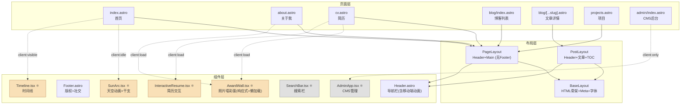

# Harry Yu 个人博客 — 项目知识图谱

> 生成时间：2026-06-12
> 项目：`alidadei.github.io` | Astro 6 + React 19 + Tailwind CSS 4

---

## 1. 整体架构

```
用户浏览器
    │
    ▼
┌─────────────────────────────────────────────┐
│  GitHub Pages (静态部署)                      │
│  alidadei.github.io                          │
│                                              │
│  ┌──────────────────────────────────────┐    │
│  │  Astro SSG 构建产物                    │    │
│  │  - HTML 页面 (.html)                  │    │
│  │  - CSS / JS bundles                   │    │
│  │  - 图片等静态资源                      │    │
│  └──────────────────────────────────────┘    │
└─────────────────────────────────────────────┘
         ▲                    ▲
         │ 构建               │ API
┌────────┴──────┐   ┌────────┴────────────┐
│ GitHub Actions │   │ Cloudflare Worker   │
│ CI/CD Pipeline │   │ (CMS 后端 API)      │
│ deploy.yml     │   │ yhl-blog-cms        │
└───────────────┘   └─────────────────────┘
                            │
                            ▼
                     GitHub Contents API
                     (OAuth 鉴权 + KV 会话)
```

---

## 2. 技术栈

| 层级 | 技术 | 版本 |
|------|------|------|
| **框架** | Astro | ^6.1.3 |
| **交互组件** | React | ^19.2.4 |
| **样式** | Tailwind CSS | ^4.2.2 |
| **Markdown** | MDX + remark-math + rehype-katex | — |
| **农历库** | lunar-javascript | ^1.7.7 |
| **3D图形** | Three.js (自托管) | vendor/three/ |
| **构建工具** | Vite (Astro 内置) | — |
| **部署** | GitHub Pages (Actions) | — |
| **CMS 后端** | Cloudflare Worker + KV | — |
| **Node** | >= 22.12.0 | — |

---

## 3. 页面路由图

```
/ (根路径)
 └─→ 重定向 /zh/

/rss.xml                    RSS 订阅源

/[lang]/                    首页 (SunArc天空+3D背景+最新文章)
/[lang]/about/              关于我 (自我介绍/News/教育/实习/项目/获奖/联系/AwardWall彩蛋)
/[lang]/cv/                 简历 (折叠面板，旧版保留)
/[lang]/projects/           项目展示
/[lang]/blog/               博客列表 (时间线 + 分类 + 搜索)
/[lang]/blog/[slug]/        博客文章详情 (TOC侧边栏 + 面包屑)
/[lang]/blog/category/[..]/ 分类页
/[lang]/admin/              CMS 管理后台 (noindex)
```

**语言前缀**：`/zh/` 中文 (默认) | `/en/` 英文

---

## 4. 组件依赖关系



> ⚛ = React 组件 (需要 client: 指令水合)
> 其余为 Astro 组件 (静态渲染，0 JS)

---

## 5. 数据流

```
┌───────────────────────────────────────────────────────┐
│  数据源                                                │
│                                                        │
│  src/data/                                             │
│  ├── site.ts          站点配置 (作者/导航/社交链接)       │
│  ├── categories.json  分类树 (3顶级 + 子分类)            │
│  ├── categories.ts    分类工具函数                       │
│  └── quotes.json      每日一句 (中英各10条)               │
│                                                        │
│  src/content/                                          │
│  ├── posts/zh/        10篇博客文章 (Markdown)            │
│  ├── portfolio/       2个作品集项目                      │
│  └── (projects/)      空 (待填充)                       │
│                                                        │
│  src/i18n/                                             │
│  ├── ui.ts            UI翻译字典 (38 key × 2语言)       │
│  └── (lib/i18n.ts)    路由工具函数                       │
│                                                        │
│  public/images/       ~60+张图片素材                     │
└───────────────────────────────────────────────────────┘
                    │
                    ▼  Astro 构建时注入
┌───────────────────────────────────────────────────────┐
│  页面组件 (Astro frontmatter)                           │
│                                                        │
│  getCollection('posts')  ──→  文章列表/排序/过滤         │
│  getCollection('projects') ──→ 项目列表                 │
│  import siteConfig      ──→  导航/作者信息              │
│  import categories.json ──→  分类树渲染                 │
│  import quotes.json     ──→  每日一句数据               │
│  getUI(lang, key)       ──→  界面文字翻译               │
└───────────────────────────────────────────────────────┘
                    │
                    ▼  静态生成 HTML
┌───────────────────────────────────────────────────────┐
│  dist/                                                 │
│  HTML页面 + CSS/JS bundles + 静态资源                    │
└───────────────────────────────────────────────────────┘
```

---

## 6. 内容集合 Schema

### posts (博客文章)
```
title: string          文章标题
description?: string   摘要描述
date: Date             发布日期
updated?: Date         更新日期
tags: string[]         标签列表
categories?: string[]  分类路径 (如 ["tech-learning", "deep-learning"])
category?: string      旧版分类 (兼容)
image?: string         封面图
draft?: boolean        草稿 (默认 false)
lang: zh | en          语言 (默认 zh)
```

> **写作规范：** 标题只在 frontmatter 的 `title` 字段中声明，PostLayout 会自动渲染为页面 H1。正文内容从 `##` (h2) 开始写，**不要在正文中写 `# 标题`**，否则会与页面标题重复。

### projects (项目)
```
title: string          项目名称
description: string    项目描述
date: Date             日期
tags: string[]         标签
github?: string        GitHub 链接
demo?: string          在线演示链接
image?: string         封面图
featured?: boolean     是否精选
lang: zh | en          语言
```

### portfolio (作品集)
```
title: string          标题
excerpt?: string       摘要
image?: string         图片
link?: string          外链
```

---

## 7. 分类体系

```
博客分类树
├── tech-learning (学习笔记)
│   └── deep-learning (深度学习)
│       └── transformer
│   └── embedded (嵌入式)
│   └── data-structure (数据结构)
├── personal-practice (个人实践)
└── personal-views (个人调研&感悟)
```

---

## 8. 样式系统

```
global.css
├── @import "tailwindcss"
├── @theme { 自定义颜色变量 }
│   ├── primary: #5b4636 (深棕)
│   ├── accent: #b07d4f (铜色)
│   ├── bg: #faf6f0 (米白)
│   ├── text: #3a2e24 (深棕文字)
│   └── border: #ddd2c2 (浅棕边框)
│
├── 基础排版 (body 字体/行高/平滑)
├── 动画 (.fade-in / .stagger-in)
├── 文章排版 (.prose h1-h4 / blockquote / table / code)
│   ├── img: max-width:100% + height:auto (防溢出)
│   └── table: display:block + overflow-x:auto (横向滚动)
├── 组件样式 (.post-card / .tag-chip / .toc-link)
├── 滚动条美化
└── prefers-reduced-motion 适配
```

**字体**：Inter (自托管 woff2) + Noto Sans SC (系统回退) + PingFang SC + Microsoft YaHei

---

## 9. CMS 后端架构

```
管理员浏览器
    │
    ▼
/admin/ 页面 (React SPA)
    │
    ▼  API 调用
Cloudflare Worker (yhl-blog-cms)
    │
    ├── /api/auth/login      → GitHub OAuth 授权
    ├── /api/auth/callback    → 换取 token + 创建 KV 会话
    ├── /api/posts            → CRUD 博客文章
    ├── /api/file/*           → 读写任意文件 (categories.json 等)
    ├── /api/images           → 上传/删除图片
    ├── /api/batch            → 批量操作 (GraphQL commit)
    ├── /api/deploy/status    → 查看 GitHub Actions 部署状态
    │
    ▼
GitHub Contents API
    │
    ▼  推送代码
GitHub Repository
    │
    ▼  触发
GitHub Actions → 构建 → 部署到 GitHub Pages
```

---

## 10. 客户端交互汇总

| 页面 | 交互 | 实现方式 |
|------|------|----------|
| 首页 | 天空动画 (实时太阳位置/日升日落) | React SunArc (client:idle) |
| 首页 | 干支日期逐字打出 | React useState + setInterval |
| 首页 | 每日一句轮换 | Vanilla JS (fetch `/quotes.json` + 按日期取模) |
| 首页 | 3D背景场景 (warm-storybook风格) | Three.js iframe (桌面端含Bloom / 移动端跳过Bloom) |
| 博客列表 | 搜索过滤 | Vanilla JS (标题匹配) |
| 博客列表 | 分类标签切换 | Vanilla JS (DOM toggle) |
| 博客列表 | 搜索框展开/收起 | Vanilla JS (max-width transition) |
| 文章详情 | TOC 侧边栏生成 + 滚动追踪 | 桌面端: 固定侧栏 / 移动端: 右侧悬浮按钮+滑出面板 |
| 文章详情 | 平滑跳转 | Vanilla JS (getBoundingClientRect) |
| 简历 | 折叠面板展开/收起 | Vanilla JS (max-height transition) |
| 简历 | 全部展开/收起 | Vanilla JS |
| 简历 | 导出 PDF | window.print() |
| 关于我/简历 | 照片墙彩蛋 | React AwardWall (client:load) |
| 全局 | 移动端汉堡菜单动画 (max-height+opacity) | Vanilla JS + CSS transition |
| CMS 后台 | 文章增删改 + 图片管理 + 部署 | React AdminApp (client:only) |

---

## 11. 文件清单

```
alidadei.github.io/
├── .github/workflows/deploy.yml      # CI/CD
├── astro.config.mjs                   # Astro 配置
├── package.json                       # 依赖
├── tsconfig.json                      # TS 配置
├── CLAUDE.md                          # Claude Code 指令 (精简版)
│
├── docs/                              # 文档
│   ├── knowledge-graph-en/            # 知识图谱
│   │   └── knowledge-graph.md         # ← 本文件
│   ├── MAINTENANCE.md
│   ├── PRD-blog-category.md
│   ├── plan-blog-category.md
│   ├── posts-writing-guide.md          # 博客写作规范 (原posts/README.md)
│   ├── 问题.md                          # 待修复问题清单
│   └── ...
│
├── public/                            # 静态资源
│   ├── 3d-background.html             # 3D场景 (Three.js warm-storybook)
│   ├── favicon.ico / favicon.svg
│   ├── robots.txt
│   ├── fonts/                         # 自托管 Inter 字体 (woff2)
│   │   ├── inter-400.woff2
│   │   ├── inter-500.woff2
│   │   ├── inter-600.woff2
│   │   └── inter-700.woff2
│   ├── images/                        # ~60+张图片
│   │   └── posts/                     # 博客配图
│   ├── portfolio/                     # 作品集资源 + 独立HTML
│   ├── files/                         # PDF 论文/Slides
│   └── vendor/three/                  # 自托管 Three.js + 后处理着色器
│       ├── three.module.js
│       ├── postprocessing/
│       └── shaders/
│
├── src/
│   ├── content.config.ts              # 内容集合 Schema
│   ├── styles/global.css              # 全局样式
│   │
│   ├── data/                          # 数据层
│   │   ├── site.ts                    # 站点配置
│   │   ├── categories.ts             # 分类工具
│   │   ├── categories.json           # 分类树
│   │   └── quotes.json               # 每日一句
│   │
│   ├── i18n/ui.ts                     # 翻译字典 (38 key × 2语言)
│   ├── lib/i18n.ts                    # i18n 路由工具
│   │
│   ├── layouts/                       # 布局
│   │   ├── BaseLayout.astro           # HTML 骨架
│   │   ├── PageLayout.astro           # Header+Main (无Footer)
│   │   └── PostLayout.astro           # 文章布局+TOC (桌面端侧栏 / 移动端悬浮面板, header mb-4)
│   │
│   ├── components/                    # 组件
│   │   ├── layout/
│   │   │   ├── Header.astro           # 导航栏 (移动端动画菜单+触摸友好)
│   │   │   └── Footer.astro           # 页脚
│   │   ├── ui/
│   │   │   ├── SunArc.tsx             # 天空动画 ⚛
│   │   │   └── AwardWall.tsx          # 照片墙彩蛋 ⚛ (响应式+懒加载)
│   │   ├── timeline/
│   │   │   └── Timeline.tsx           # 时间线 ⚛
│   │   ├── blog/
│   │   │   └── SearchBar.tsx          # 搜索 ⚛
│   │   ├── resume/
│   │   │   └── InteractiveResume.tsx  # 简历交互 ⚛
│   │   └── admin/
│   │       ├── AdminApp.tsx           # CMS管理 ⚛
│   │       └── bootstrap.ts           # CMS入口
│   │
│   ├── pages/                         # 页面路由
│   │   ├── index.astro                # 根路径重定向
│   │   ├── rss.xml.ts                 # RSS
│   │   └── [lang]/
│   │       ├── index.astro            # 首页
│   │       ├── about.astro            # 关于我
│   │       ├── cv.astro               # 简历
│   │       ├── projects.astro         # 项目
│   │       ├── blog/
│   │       │   ├── index.astro        # 博客列表
│   │       │   ├── [...slug].astro    # 文章详情
│   │       │   └── category/
│   │       │       └── [...path].astro # 分类页
│   │       └── admin/
│   │           └── index.astro        # CMS后台
│   │
│   └── content/                       # 内容
│       ├── posts/zh/                  # 10篇博客
│       └── portfolio/                 # 2个作品
│
└── worker/                            # CMS 后端
    ├── wrangler.toml
    └── src/
        ├── index.ts                   # 路由
        ├── auth.ts                    # OAuth
        ├── github-api.ts              # GitHub API
        ├── batch.ts                   # 批量操作
        └── utils.ts                   # 工具函数
```

---

## 12. 导航结构

```
当前导航 (4项 + 语言切换)
┌──────────┬──────────┬──────────┬──────────┬─────────┐
│  首页     │  关于我    │  博客     │  项目     │ English  │
│  /zh/    │/zh/about/│ /zh/blog/│/zh/proj/ │ (无边框) │
└──────────┴──────────┴──────────┴──────────┴─────────┘
Harry Yu (logo, 左上)                                   右移2px对齐
```

**移动端行为：** 汉堡菜单按钮 → 展开/收起动画 (max-height + opacity transition) → 点击导航链接自动关闭菜单 → body 锁定滚动

---

## 13. 首页架构

```
┌─────────────────────────────────────────────────────┐
│  Header (透明, 导航右对齐, z-index: 50)               │
├─────────────────────────────────────────────────────┤
│  SunArc 天空动画 (渐变背景, 含干支+问候语)              │
│  ┌──────────────────────────────┐                    │
│  │ 丙午年 甲午月 丁巳日          │                    │
│  │ 下午好                       │                    │
│  └──────────────────────────────┘                    │
├─────────────────────────────────────────────────────┤
│                                                      │
│  3D背景 iframe (fixed, 全屏, z-index: 0)              │
│  ├─ warm-storybook风格 Three.js场景                    │
│  ├─ 农田星球地面 (绿色+PLANET 07土黄色块)               │
│  ├─ 银白头机器人 (白眼, 麦垛)                           │
│  ├─ 每日一句打字效果 (book旁, 银白色)                    │
│  └─ 时间联动亮度 (白天明亮/夜晚暗淡)                     │
│  注: 移动端也加载3D场景(跳过Bloom), 每日一句使用楷体字体    │
│                                                      │
├─────────────────────────────────────────────────────┤
│  最新文章 (银白色字体, pointer-events-auto)             │
│  └─ 日期 + 标题 + 描述                                │
└─────────────────────────────────────────────────────┘
无 Footer
```

**关键数据文件：**
- `src/data/quotes.json` — 每日一句句子库 (中文11条, 构建时自动同步到 `public/quotes.json`)
- `public/3d-background.html` — 3D场景 (独立HTML, 自托管Three.js, 移动端跳过Bloom, 每日一句从 quotes.json 动态加载)
- `public/vendor/three/` — Three.js + 后处理着色器 (UnrealBloom等)

**层级关系：**
- 3D iframe: `z-index: 0`, `position: fixed`
- 页面内容: `z-index: 1`, `pointer-events: none` (空白区域穿透到3D)
- 交互区块: `pointer-events: auto` (文章链接可点击)
- Header: `z-index: 50` (始终在最上层)

---

## 14. 性能优化记录

| 优化项 | 方式 |
|--------|------|
| 字体 | 去除 Google Fonts 外链, 自托管 Inter woff2 + 系统中文字体回退 |
| 3D 库 | Three.js 自托管 `public/vendor/three/`，避免 CDN 依赖 |
| 数学公式 | KaTeX 仅在文章详情页 (PostLayout) 加载 CSS |
| 3D 背景 | 移动端加载 Three.js 但跳过 Bloom 后处理，减轻 GPU 负担 |
| 图片懒加载 | AwardWall 所有证书图片使用 `loading="lazy"` |
| 响应式 | AwardWall 移动端单列布局，博客时间线移动端保持左右交替布局 |
| 移动端标题 | 所有页面 H1: `text-2xl md:text-3xl`，About H2: `text-xl md:text-2xl` |
| 移动端TOC | PostLayout 桌面端侧栏 TOC，移动端右侧悬浮按钮 + 滑出面板 + scroll spy |
| 触摸目标 | Header 汉堡按钮 `p-2.5`，导航链接 `py-3`，Footer 图标 `p-2`，AwardWall `p-3` |
| 布局防溢出 | prose 图片 `max-width:100%`，表格 `overflow-x:auto` 横向滚动 |
| Timeline缩进 | 移动端 `ml-3 sm:ml-4` / `pl-6 sm:pl-8` 减少左缩进 |
| 每日一句 | `3d-background.html` 通过 `fetch('/quotes.json')` 动态加载，`npm run build` 自动从 `src/data/` 同步到 `public/` |
| 每日一句字体 | 楷体字族 (STKaiti / KaiTi / 华文楷体)，全设备统一 |
| 博客正文行距 | PostLayout header `mb-4` 紧凑间距（原 `mb-10` 太宽） |
| 首页移动端间距 | spacer `h-48 md:h-72` + section `pt-12`，避免"最新文章"遮挡每日一句 |

---

## 15. 组件详情

### Header.astro — 导航栏
- 桌面端：水平导航 + 语言切换 (无边框胶囊按钮)
- 移动端：汉堡按钮 → 动画展开菜单 (max-height 0→300px + opacity 0→1, 300ms ease-in-out)
- 点击导航链接自动关闭菜单
- 菜单打开时锁定 body 滚动 (`overflow: hidden`)
- SVG 图标：汉堡 ↔ X 切换

### SunArc.tsx — 天空动画
- 基于当前时间计算太阳位置 (日升 5:30 / 日落 18:30)
- 动态天空渐变 (白天/黄昏/黎明/夜晚)
- 太阳盘 + 光晕、月牙、闪烁星星
- 农历干支日期 + 五行 (wuxing) 配色 + 打字机动画
- 时段问候语

### AwardWall.tsx — 照片墙彩蛋
- 触发方式：奖杯图标按钮
- 全屏覆盖层 + 居中精选图 (湘慧奖学金, 金色边框光晕)
- 桌面端：3列网格 (1fr 2fr 1fr)
- 移动端：单列布局 (`grid-cols-1`)
- 底部水平滚动行展示额外证书
- 交错入场动画 + ESC 关闭
- 所有图片懒加载 (`loading="lazy"`)

### AdminApp.tsx — CMS 管理面板
- 单文件 React SPA (~744行)
- GitHub OAuth 登录
- 文章编辑器 (Markdown + 实时预览)
- 标签管理 / 分类管理 / 图片管理 / 部署状态
- 自动保存到 localStorage

---

*知识图谱结束。如需更新，请基于项目实际代码重新扫描。*
