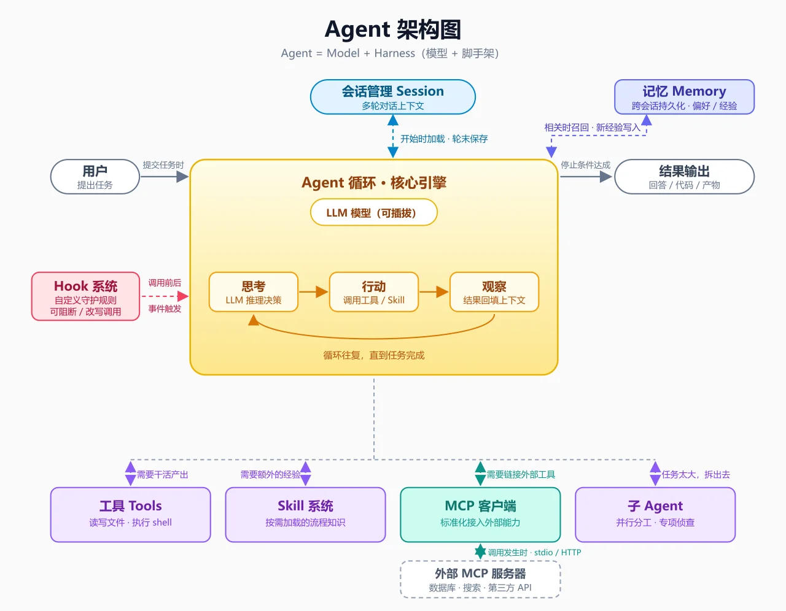
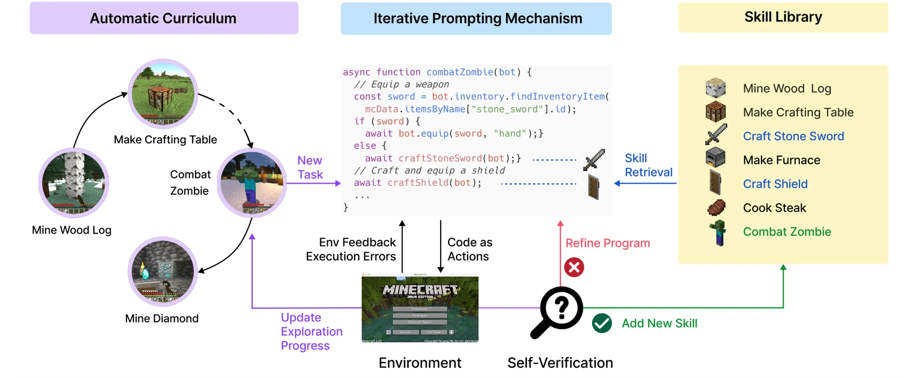
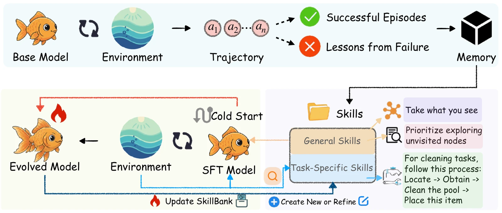
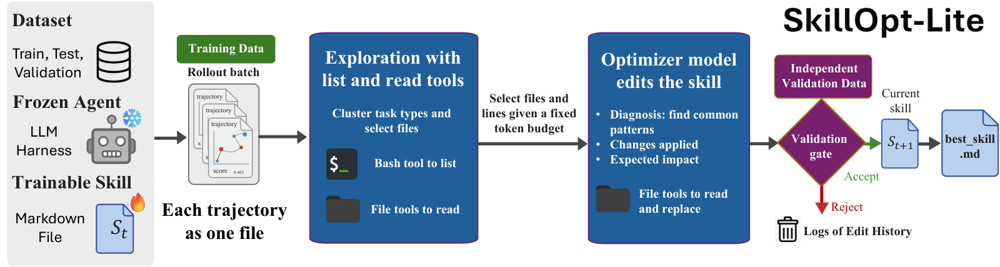
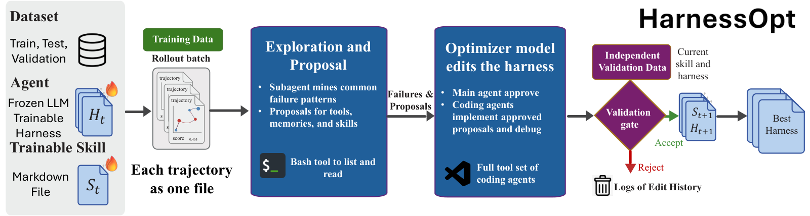

## Agent Skill 的发展历史

### Anthropic 发布 Agent Skills

2025 年 10 月 16 日，Anthropic 发表工程博客 [Equipping agents for the real world with Agent Skills](https://www.anthropic.com/engineering/equipping-agents-for-the-real-world-with-agent-skills)，正式推出 Agent Skills。Anthropic 给出的定义是：skill 是由指令（instructions）、脚本（scripts）和资源（resources）组成的文件夹，模型可以根据任务类型路由到对应的skill并用其来辅助工作。

为什么命名为 skill？Anthropic 没有专门解释命名，但从工程博客的表述看，skill 指的是「做某件事的成套方法」。Anthropic 在博客开头用了一个很传神的类比：skill 像一份**新员工入职手册**，先给你一张全貌地图，细节等到真正用到时再翻。我个人还有一个理解，心理学上知识分成陈述性知识和程序性知识，前者是「知道是什么」，后者是「知道怎么做」。RAG 往上下文里塞的主要是陈述性知识（资料、事实），而 skill 装的是程序性知识（流程、方法、判断标准）。这解释了为什么它叫 skill 而不叫 knowledge base。

Anthropic 同时还开源了 [anthropics/skills](https://github.com/anthropics/skills) 仓库，里面除了 pptx、docx、xlsx、pdf 等首发skill 之外，还有一个叫 skill-creator 的「元技能」，专门用来创建、验证和打包新的 skill。

### Skill 在 agent 技术栈里的位置

回看下agent框架发展的时间线：function calling 让模型能通过函数调用使用外部工具，MCP 为外部工具定义了统一的调用协议，skill 则将“如何做某件事”的人类经验知识针对agent系统进行了标准化。

```text
2023-06  function calling
           └─ 让模型能调用预定义函数，打通外部工具执行
2024-11  MCP（Model Context Protocol）
           └─ 把外部工具调用方式聚成统一协议，解决连接与发现
2025-10  Agent Skills
           └─ 把做事方法打包成文件夹，解决知识与经验复用
2025-12  开放标准（agentskills.io）
           └─ SKILL.md 成为跨客户端格式，OpenAI 等厂商跟进
```

skill 和 MCP 的分工，Anthropic 的定位很清楚，**MCP 负责统一地给大模型接上新工具，skill 负责标准化地喂给大模型新的任务知识**。一个 MCP server 暴露的是「该工具有哪些接口可以调、要如何调」，一个 skill 描述的是「这类任务该按什么流程、注意什么坑、产出什么格式」。两者经常配合，skill 的正文里可以引用 MCP 提供的工具。

把视角拉远，这几样东西在同一个 agent 里各就各位的样子如下图：核心循环之外，工具在需要干活产出时调用，skill 在需要额外经验时加载，任务太大就拆给子 agent，要连接外部系统则走 MCP。



### 从产品功能到开放标准

2025 年 12 月 18 日，Anthropic 把 skill 规范发布为[开放标准](https://agentskills.io)，同站提供 SDK，任何 agent 平台都可以免费实现。规范把 skill 的生命周期定义为三个阶段，discovery（扫描skill的元数据简介）、activation（任务相关时加载SKILL.md正文）、execution（按需执行附属文件与脚本）。

后续的跟进速度超出很多人预期。OpenAI 的 Codex、Google 的 Gemini CLI、Cursor、Windsurf、Amp、Goose、Opencode 等四十多个客户端宣布兼容，Google 甚至开设了 [google/skills](https://github.com/google/skills) 官方仓库。一个由单一厂商发起的格式，三个月内变成了 agent 领域的事实标准， anthropics/skills 仓库也一举冲到了 51.3K stars。

由于skill的组成、加载和路由全部是由 prompt 驱动的，所以 skill 的编写和接入门槛极低：不需要写代码，一个文件夹加一份 markdown即可构成一个skill，因此skill逐渐变成了一种全民制作产物。

## skill规范

skill 的本质是一个帮助 LLM 完成特定任务的资料包，但要让资料包顺畅地融入整个 agent 工作流，Anthropic 在 Claude 平台文档的[撰写规范](https://platform.claude.com/docs/en/agents-and-tools/agent-skills/best-practices)里给了相当具体的约束。

### 一个 skill 长什么样

```text
my-skill/
├─ SKILL.md        元数据（name + description）+ 正文地图
├─ reference.md    细节文档，正文引用时才被读取
├─ assets/         模板、样例等静态资源
└─ scripts/        可执行脚本，交给沙箱运行
```

元数据是整个路由系统的关键，两个字段都有硬性数字要求。

| 字段 | 约束 | 写法要点 |
|---|---|---|
| name | 不超过 64 字符 | 第三人称描述动作，如 Processing insurance claims |
| description | 不超过 1024 字符 | 第三人称写清 what 和 when，包含触发关键词 |
| SKILL.md 正文 | 建议不超过 500 行 | 当地图用，细节移入 reference 文件 |

### skill 的核心加载机制：渐进式披露

skill 具体如何在一个agent系统中工作？Anthropic 的工程博客把核心设计原则叫 **progressive disclosure（渐进式披露）**，分三级加载。

```text
agent 启动
   │
   ▼
Level 1  预载所有 skill 的 name + description
   │      每个 skill 约 30~50 tokens
   │
   ▼  任务描述命中某个 description
Level 2  加载该 skill 的 SKILL.md 正文（完整方法论）
   │
   ▼  正文引用了细节文档或需要执行脚本
Level 3  按需读取 reference 文件 / 加载资源 / 在沙箱中运行脚本
```

这套机制的本质是为了节省大模型宝贵的上下文和注意力（context engineering）。Anthropic 在博客里打了个比方，skill 像一本组织良好的手册，先给目录，再给章节，最后才是详细的附录，用到哪一层才翻到哪一层。也正因为细节都躺在文件系统里按需取用，Anthropic 明确说捆绑进一个 skill 的资料量实际上没有上限。实际上，启动时预载进系统提示的只有每个 skill 的 name 和 description 两行元数据。被加载的主体始终是 SKILL.md 这类 markdown 文件和脚本，Anthropic 的博客里也没有「大文件直接入上下文」的设计，压缩进 skill 的资料只在命中时才展开。

### 撰写原则

Anthropic 的规范文档里反复强调的第一原则是简洁。原文说得很直接，"Claude is already very smart"，skill 要提供的是任务特有的流程和判断，通用的能力不需要教。与之配套的两条操作建议是，**多写判断依据，少写死规则**，让模型保留根据实际情况变通的余地；**一个 skill 只做一件事**，主题有重叠时靠 description 的边界描述来分工。

规范里我个人觉得最有价值的部分是 eval-first 的工作流。Anthropic 的文档建议在动笔写 skill 之前，先准备至少三个评测输入，覆盖该 skill 的主要使用场景，明确每个输入的期望输出。迭代阶段甚至不需要搭建评测基建，直接让 Claude 用同一个 prompt 分别跑新旧两个版本，对比输出差异即可。这个「先定验收标准再写说明书」的思路，和软件工程里测试先行的理念完全相同。

### 怎么判断 skill 的好坏

这是我自己最关心的问题，**目前 Anthropic 还没有发布官方的 gold answer 或 benchmark**。Anthropic 的规范只给了撰写层面的启发式约束，没有发布过一个可以量化打分的评测集。github上面则有几个值得参考借鉴的思路：

行为层面的代表是 [SkillForge](https://github.com/tripleyak/SkillForge)（876 stars），口号是 skill quality is a property of behavior, not documents，好坏要看行为，文档不算数。它的流程先让一个全新子 agent 在不带 skill 的情况下先试任务并记下失败点，没失败就说明根本不需要这个 skill，然后再跑 一个带skill的子agent进行对照，带 skill 的子 agent必须清掉基线失败项才算过关，每个 skill 自带可重跑的回归测试，另有一个体检脚本检查技能之间的触发冲突和重复。

静态层面的代表是 [agnix](https://github.com/agent-sh/agnix)（392 stars）。linter 是编程界的老概念，指不运行代码、只按一套既定规则扫文本挑毛病的静态检查工具，专治格式、命名和写法问题，agnix 用 Rust 把这个思路搬到了 SKILL.md 上，448 条规则里 31 条专门针对它，查命名、格式和触发可靠性。自动修复的原理也不复杂，每条规则除了报错还配好了对应的机械改写动作，比如发现 skill 名字里混了大写字母，就直接改成小写连字符写回文件，安全模式只应用高置信度的修复，激进模式连中低置信度的也一起改，还能先预览改动再决定要不要应用。

## Skill 和 Prompt 的区别

个人认为，当前的大部分 skill 就是一种更方便 agent 系统管理和加载的 prompt 文档。它的优点是只在特定任务时机才加载进模型上下文，同时skill会更加方便复用和版本迭代，算是 prompt engineering 和 context engineering 的结合。

有一个很直接的证据支持这个判断。把 SKILL.md 的内容直接粘贴进 system prompt 能达到几乎一样的效果，skill 系统还专门保留这种「无路由」的用法。也就是说，skill 的正文和一份精心写的 prompt 在内容层面没有本质区别，区别全在进入上下文的方式上。

| 维度       | 一次性 prompt           | skill                        |
| ---------- | ----------------------- | ---------------------------- |
| 存放位置   | 聊天框、笔记、CLAUDE.md | 独立文件夹，带元数据         |
| 加载时机   | 手动粘贴或全局常驻      | 任务命中才加载，按层级展开   |
| 上下文成本 | 常驻型配置持续占用窗口  | 平时只占 name 与 description 两行元数据 |
| 复用与分发 | 复制文本，容易失真      | git 管理整目录，直接分享安装 |
| 版本迭代   | 改完没有沉淀            | diff、issue、release 齐全    |

所以我对 skill 的定位是，**它首先是一套 prompt 的工程化管理制度，其次是一种压缩了人类经验的特殊prompt**。因此，一份skill的质量很大程度上依赖于skill.md文档的质量，而这就取决于构建者的prompt能力了，所以实际上“prompt engineering never dies”。

## Skill 生态

### 生态全景

开放标准落地后不到一年，skill生态已经逐渐分层。下面是 2026 年 8 月时点的主要节点。

| 仓库 / 站点 | 定位 | 规模与状态 |
|---|---|---|
| [anthropics/skills](https://github.com/anthropics/skills) | Anthropic 官方示范仓库 | 51.3K stars，含 skill-creator 元技能 |
| [google/skills](https://github.com/google/skills) | Google 官方仓库 | 围绕 Google 产品与技术栈 |
| [VoltAgent/awesome-agent-skills](https://github.com/VoltAgent/awesome-agent-skills) | 社区精选清单 | 收录 1000+ skill，标注兼容客户端 |
| [mattpocock/skills](https://github.com/mattpocock/skills) | 个人工程师经验蒸馏 | grill-me 出身处，后文详述 |
| [agent-skills.cc](https://agent-skills.cc/claude-skills/hot) | skill 排行榜 | 按 stars 和 forks 排序热度 |
| skills.sh | 跨 agent 安装器 | 一条命令把 skill 装进多种 CLI |

生态繁荣的另一面是安全问题：SkillRisk 对 GitHub 上 star 数前 100 的 skill 做过漏洞分析，Red Hat 开发者站点也专文讨论过 skill 的安全漏洞，其本质是通过提示词注入的攻击方式让危险文本进入你的 agent 上下文，因此在安装skill前最好检查下内容。

### 优秀 skill 案例

 [mattpocock/skills](https://github.com/mattpocock/skills) 是一个优秀程序员的开源skill仓库，作者是知名 TypeScript 教育者 Matt Pocock。

仓库 README 中把工程师用 agent 的四大失败模式和对应的 skill 修复整理成了一张表。

| 失败模式               | 对应 skill                     | 修法                           |
| ---------------------- | ------------------------------ | ------------------------------ |
| agent 做的不是我想要的 | grill-me / grill-with-docs     | 实施前把计划拷问到位           |
| agent 太啰嗦           | 共享语言 CONTEXT.md            | 用项目术语表对齐表达           |
| 代码跑不起来           | /tdd、/diagnosing-bugs         | 红绿重构，先测试后实现         |
| 代码库烂成泥球         | /improve-codebase-architecture | 按 Ousterhout 的深模块理念重构 |

这些 skill 蒸馏自《The Pragmatic Programmer》、Eric Evans 的领域驱动设计、Kent Beck 的测试实践和 Ousterhout 的《A Philosophy of Software Design》。这也是 skill 的价值所在，**把久经考验的书本经验变成 agent 执行任务时的默认行为**。

#### grill-me

grill-me是该仓库中的一个经典优质skill，其README 里的一句话介绍为："Get relentlessly interviewed about a plan or design until every branch of the design tree is resolved"。其作用就是让agent针对你的计划或设计，反复向你提问，逼着你把每个没想清楚的分支都补齐，全问完了才开始动手写代码。

这个 skill 精简到什么程度？我把它的 SKILL.md 原文拉出来数了一遍，其正文只有一句话，Call the Skill tool with "grilling"，六个词。加上三行元数据，整个文件不到二十个词。真正的审问逻辑在另一个叫 grilling 的 文档里，grill-me 只是个入口壳，它的 frontmatter 里还写了 disable-model-invocation: true，即模型不许自动触发，只有用户主动敲 /grill-me 才启动。这种两层设计，既能让用户准确唤起整套工作流，平时确又只有六个词的路由成本，是非常优秀的context engineering。

grilling 的正文值得完整读一遍，它把拷问计划这件事做成了一套可执行的算法。它先让你把计划建模成一棵设计树，每个决策都挂着依赖它的后续决策；然后按轮次提问，每轮只问「前置已定」的问题，它管这叫 frontier，也就是现在不用猜任何答案就能问的问题，一轮打包问完，每个问题附上 agent 自己的推荐答案，用户答完后重新计算下一轮。事实和决策也分得很清，需要查文件系统、查环境的事实派子 agent 自己去找，绝不拿自己能查到的事去烦用户，留给用户的只有决策本身。终止条件同样写得死死的，frontier 清空、每个分支都问过、没有默默假设的东西，且用户确认达成共识，审问才算结束。

这里也顺便回答了我自己最初的一个疑问，它和 Claude Code 内置的 AskUserQuestion 有啥区别？AskUserQuestion 是 agent 的提问工具，模型碰到只有用户能定的选择时便用它“举一下话筒”，给出交互选项，它解决的是「怎么问」的交互形式，问不问、问多深全看模型当下的自觉；而grilling 则给模型提供了一份预置的“提问剧本”，告诉模型“要如何提问”，从而让模型提问的覆盖率和边界都有了结构性保证，就好像一名记者不仅要递出话筒，还要有一个严密的采访大纲才能做好采访，这两者实际上是一种完美的互补。

#### eli5

这是一个 Anthropic 员工放进官方社区插件市场 [anthropics/claude-plugins-community](https://github.com/anthropics/claude-plugins-community) 的 skill，由 Claude Code 工程师 Thariq Shihipar 在 2026 年 8 月 22 日于 X 上公开，两天拿到约 1.17 万赞，是最近最出圈的一个。我翻了仓库提交记录，8 月 21 日晚间六分钟内连打了五笔提交，其中三笔都在改那句 prompt 的措辞，看得出作者是真在一个词一个词地抠。

其 SKILL.md 去掉元数据后正文只有一句话，正好二十个词：Explain like I'm someone who knows nothing about this topic, using a HTML artifact with big pictures and few words，再附一行接收话题参数的模板，整个文件 321 字节。

具体在claude code中的用法是 /eli5 加一个话题，便会产出一张 HTML 图解卡片，大图配极少文字，比如讲 DNS 就是五张大图五个步骤，几乎见不到成段的文字，极易人类理解。

和 grill-me 的六个词入口一样，它也是极简主义的样本。一句话能打穿，是因为每个词都压在了正确的约束上，knows nothing 把受众钉死成完全外行，big pictures and few words 拦住模型默认的小作文输出，HTML 这个载体则放开了排版、SVG 和动画的表达力。评论区也有人点破另一半真相：它的火爆恰恰说明模型默认输出太啰嗦，而它让答案变得更好懂，模型本身并没有变聪明。还有前 Stripe 员工晒出更早的出处，同类技能 2023 年底就在 Stripe 内部用过，做了三档难度。这句 prompt 直接粘进聊天框效果几乎一样，skill 在这里提供的依然只是便于管理、触发和分发的作用。

### 把人或书籍蒸馏成 skill

顺着上面的思路，社区已经把「skill蒸馏」做成了一种流行玩法。其做法高度一致。把一本书或一个人的全部文字喂给模型，让它用 skill-creator 把内容蒸馏成若干个 skill，正文只留方法论骨架，原书章节降级为按需加载的 reference 文件。Ruben Hassid [公开演示过](https://www.threads.com/@rubenhassid/post/DX9FrwDgsqN/)五分钟把一本技术书变成 skill 的完整流程，Reddit 上也有用户[用整个书架的书](https://www.reddit.com/r/ClaudeAI/comments/1q8cqg9/building_unique_agents_from_your_book_collection/)构建自己的 agent 技能库。

对个人创作者，这条路更诱人。你可以把某位作者的文章、某个博主全部帖子喂进去，蒸馏出他的选题嗅觉、行文节奏和判断标准，再让 agent 用这套标准参与你的创作。

## 学术界的 skill 研究

学术界对 skill 的关注比 Anthropic 的产品发布更早，2026 年之后两者明显合流。下面按时间线梳理四篇代表性工作，以下会有较多论文解读内容，不感兴趣的读者请自行跳过。

### Voyager，技能库的起点

[Voyager](https://arxiv.org/abs/2305.16291)（2023）是 skill library 概念的起点，主角是一个玩 Minecraft 的 agent。它玩游戏的姿势很像一个会记笔记的玩家，一套自动课程会不断给它越来越难的目标，每当它练会一个目标的代码比如造出一件工具，这段代码就存进技能库；下次遇到更难的目标，它不从头练，直接翻库把旧招式拼起来用。**该研究证明经验一旦变成可复用的单元存下来，agent 的本事就能越滚越多，而不用每次从零开始**，这个思想为后面的skill工作奠定了基础。



### SkillRL，让技能库跟着策略一起进化

[SkillRL](https://arxiv.org/abs/2602.08234)（2026 年 2 月，ICLR 2026 自我改进研讨会）把上面这件事搬进了强化学习训练期。



论文的做法分两步。第一步是冷启动，先请一个更强的老师模型教基座模型（Qwen2.5-7B）学会使用skill。第二步才是强化学习，算法用 GRPO，损失是 PPO 式的截断目标外加一项 KL 正则，正则锚在冷启动后的模型上，防止训练把「会用 skill」这个本事练丢。

skill 条目本身既不进损失也不进奖励，它是在采样时拼进上下文的，通用技能常驻，任务特定的技能按语义相似度检索出最相关的前六条。奖励函数则朴素到家:就是环境给的零一成败信号，没有任何为 skill 设计的额外奖励项，一组八条轨迹内部做相对排名，好于平均的被加强，差于平均的被削弱。

每个训练阶段结束后，会对通过率低于阈值的任务类别收集失败轨迹，交给老师模型分析哪些失败模式是现有技能没覆盖的，然后增补或修订对应的 skill 条目，整个训练过程中技能库从 55 条长到了 100 条，消融实验里关掉这个外循环，成绩要掉 5.5 个点。最初那批技能也出自这位老师，把成功轨迹蒸成策略模式，把失败轨迹蒸成一条条教训，写清在哪一步失败、推理错在哪、本该怎么做、能提炼出什么通用原则。所以这篇论文的优化对象其实有两个，模型靠 GRPO 练，技能库靠老师模型看失败补课，两层交替滚动，论文管这叫技能库与策略共同进化。

最终在 ALFWorld、WebShop 和七个搜索增强任务上取得 SOTA，超基线 15.3%，而且经验条目比原始过程日志紧凑得多，token 消耗反而降低 10% 以上。

### skill 过多会怎样

[More Skills, Worse Agents?](https://arxiv.org/abs/2605.24050)（2026 年 5 月，Databricks 团队）是对 skill 生态的一盆冷水。实验自建了一套受控执行环境，先把库里全部 skill 的名字和描述给模型，模型自己决定调哪个，最后由独立的确定性测试集（另一个团队更早发布的 [SkillsBench](https://arxiv.org/abs/2602.12670)）按子任务逐项判分，模型用了 Anthropic 的 Haiku 4.5 和 Sonnet 4.6 两款，一共 2545 条轨迹。评测集的 88 个任务覆盖文档处理、金融、科学计算、数据分析等领域，每个任务自带一份作者手工配的技能包，一到七个 skill 不等，把 88 个任务的技能包去重合并就得到 202 个 skill 的大库。作者先筛出技能包里每个 skill 都能带来至少 4 个百分点提升的 38 个任务模型组合，对照组只装任务自带的技能包，实验组把库逐级扩到 52、102、202。

实验结论直白，**库从任务自带的两三个 skill 扩到 202 个，通过率最多跌 21%**，52、102、202 三档对应的跌幅分别是 8%、14%、21%。

论文把任务跌幅假设拆解成了两类原因，**skill shadowing（技能遮蔽）：指库变大后，描述相近的干扰项把正确 skill 挡在了选择之外**，这个名字借自编程里的变量遮蔽，agent 要么选错技能，要么明明库里有能用的却一个都不调。**context overhead ：指的是即便选对了，膨胀的上下文也可能拖累执行**。结果显示：遮蔽效应随库规模稳定增长，贡献了最多 68% 的跌幅，是唯一统计上站得住的失效机理；上下文开销的点估计虽为正，但在任何规模下都与噪声难以区分。

同时，两款模型各有各的失败姿势，Haiku 偏向弃疗，库扩到 202 个时一条 skill 都不调的比例从 19% 涨到 66%；Sonnet 偏向选错，库越大越爱调用不相干的技能。论文给出的解决方案是把选择环节工程化，检索式预筛、更可区分的 description、学习型路由都在建议清单里。

其中，SkillsBench的代码和轨迹开箱可用，仓库在 [benchflow-ai/skillsbench](https://github.com/benchflow-ai/skillsbench)（1.7K stars），想复现或在此基础上继续做实验可以直接上手。

### SkillOpt，把 skill 优化当成零阶优化问题

[SkillOpt-Lite](https://arxiv.org/abs/2607.03451)（2026 年 7 月）把「改 skill」变成了一件数学上说得清的事。作者于是把 skill 迭代当成零阶（Zeroth-Order）优化问题。零阶是相对一阶说的，一阶优化手里有导数，知道往哪个方向调参数，梯度下降是典型；零阶手里只有试出来的结果，好比调一台没有说明书的收音机，只能拧一档听一下，多试几档对比着来。skill 是自然语言文本，任务得分对它求不了导，梯度信息天然不存在，所以只能走这条靠试靠比的路。将优化目标写成一个期望式子，底层模型和执行框架都当作固定环境，skill 文本是唯一的自变量，要最大化的是任务得分的期望。具体的求解是一个四步的自动循环：先让 agent 挂着现有 skill 跑一批任务，每条执行轨迹原样落盘成一个独立的文本文件；接着派一个编码 agent 拿着文件系统工具去翻这个目录，把失败的任务聚成簇，挑出信息量最大的几份日志细读。然后从多条轨迹里找共同的反模式，只修多个任务都踩的坑，单次执行的偶然失误不碰，改完生成一个尽量小的补丁。最后是验证门控，候选 skill 拿到一份独立的验证集上跑分，比现役版本好就转正，超过历史最好成绩就覆盖写回 best_skill.md，不然就归档淘汰。



这篇论文的代码落地的方式轻得出奇，作者把整个循环封装成一个 VS Code 插件，敲一行斜杠命令就开跑，标题里的 one line of vibe 说的就是它。 

顺着「skill 和轨迹都是文件」的思路再进一步，同一批作者在同一篇论文里进一步提出了扩展版 HarnessOpt: 把可编辑的路径范围放开，编码 agent 连执行框架的代码也能一起改。为什么一篇讲 skill 优化的论文要管到框架？原因在于他们在 SpreadsheetBench 上做诊断时发现，有些瓶颈出在执行框架本身，有的模型需要更大的表格预览和额外的答案校验步骤，有的模型容易陷入重复推理循环，得拦截下来强制换思路重试，这类问题没有一条 skill 文本能修，于是干脆把优化对象扩展到了框架代码，这一实验也充分说明了skill的能力边界。



最终的跑分也相当能打：LiveMathCode 上 GPT-5.5 提升 8.8 分，GPT-5.4-nano 提升 25.4 分；SpreadsheetBench 上，配了 HarnessOpt 的 nano 达到 0.7758，反超裸奔的 GPT-5.5（0.7620），而 nano 的价格只有前者的九分之一。论文说明：**小模型加好的技能和harness，能干过大模型裸奔**，同时也论证了skill的边界。

综合这四篇，学术界对 skill 的定位可以收拢成一句话，**skill 是把原始经验压缩成可执行知识的最小单元，也是 agent 自我改进循环里目前最可行的载体**。SkillRL 和 SkillOpt 站在「怎么自动产出好 skill」这一端，More Skills 这篇站在「怎么克制地用 skill」这一端，两端共同框定了当前的认知边界。

## 什么时候用 skill，什么时候用 prompt

把上面的内容消化完，我们应该能得到如下的判断：

用 prompt 就够的场景主要是一次性任务（比如临时起意想用AI查个东西），为它们建 skill 是杀鸡用牛刀，还会白白增加skill系统的路由难度。

值得升级成 skill 的信号主要有：同一套指令你来回复制粘贴过多次；但是该指令的内容又很长，塞进 CLAUDE.md 会挤压其他内容；或者你想把这套经验分享给别人、挂在 GitHub 上迭代。三者命中其一，就值得把 prompt 抽出来，补上 name 和 description，做成一个skill文件夹。

## 个人看法

### skill 的最大意义

我的核心判断是，**skill 的最大意义在于把针对特定任务的资源包（大部分其实是 prompt文档）打包管理、迭代，并分发给别人的 agent 复用**。它用人类智慧结晶来辅助 LLM 更好地完成人类擅长的任务。56 年软件工程攒下的经验、一本经典书的方法论、一位资深工程师的工作习惯，过去只能靠人肉阅读内化，现在可以打包成 skill 直接挂到 agent 身上。SkillOpt 那组「nano 加技能反超大模型」的数字说明，这笔人类遗产的杠杆率相当高。

### 两点局限

第一，skill 过多会反噬。这一点我在前文已经给过数据，库从任务自带的两三个扩到 202 个，通过率最多掉 21%，而且失效主要发生在选择环节。目前的 skill 检索是模型在元数据层面做的语义匹配，没有倒排索引兜底，量一大必然漏配和误配。

第二，大量 skill 不具备通用性，甚至会把 skill 退化成一份 reference 文档。典型样本是专门针对某家公司规范或某位老板口味写的内部说明书，离开那个特定的应用场景就失效了。这类内容本来该走 RAG 或知识库，被硬塞进 skill 的壳子里，既占了整个agent系统的路由位，又稀释了「skill 是做事方法」这个语义。我翻社区市场时，相当比例的 skill 属于这类场景特化品。

### 我的用法

不在我知识范畴（我基本上看不懂）但是和我的需求场景高度对口的高 star skill，我一般选择直接安装照搬，比如 office cli官方的skill；不确定对不对口但是和我的专业知识相关的高质量skill，我认为不必着急安装，但可以通过这种skill来学习他人的优秀经验（哈哈，奇怪的学习方式又多了）。skill 生态对我更大的价值在于它是一座公开的方法论样本库，每个高 star skill 都是一位作者公开的独家工作经验，有时候读 skill 本身就是在学做事。

## 信息来源

| # | 来源 | 链接 |
|---|---|---|
| 1 | Anthropic 工程博客，Agent Skills 发布文（2025-10-16） | https://www.anthropic.com/engineering/equipping-agents-for-the-real-world-with-agent-skills |
| 2 | Agent Skills 开放标准官网（2025-12-18） | https://agentskills.io |
| 3 | Claude 平台文档，skill 撰写最佳实践 | https://platform.claude.com/docs/en/agents-and-tools/agent-skills/best-practices |
| 4 | anthropics/skills 官方仓库 | https://github.com/anthropics/skills |
| 5 | mattpocock/skills（grill-me 出处） | https://github.com/mattpocock/skills |
| 6 | VoltAgent/awesome-agent-skills 生态清单 | https://github.com/VoltAgent/awesome-agent-skills |
| 7 | Voyager 论文（arXiv 2305.16291） | https://arxiv.org/abs/2305.16291 |
| 8 | SkillRL 论文（arXiv 2602.08234） | https://arxiv.org/abs/2602.08234 |
| 9 | SkillOpt-Lite 论文（arXiv 2607.03451） | https://arxiv.org/abs/2607.03451 |
| 10 | More Skills, Worse Agents? 论文（arXiv 2605.24050） | https://arxiv.org/abs/2605.24050 |
| 11 | SkillsBench 基准论文（arXiv 2602.12670） | https://arxiv.org/abs/2602.12670 |
| 12 | Medium，The Skills Revolution（stars 增长数据） | https://medium.com/codex/the-skills-revolution-how-4-github-repos-are-making-ai-10x-smarter-and-why-youre-already-behind-33d89c477ab0 |
| 13 | SkillRisk，Top 100 skills 安全分析 | https://skillrisk.org/blog/top-100-github-skills-security-vulnerabilities-analysis/ |
| 14 | dev.to，The most popular AI coding skills right now | https://dev.to/aws/the-most-popular-ai-coding-skills-right-now-4183 |
| 15 | Ruben Hassid，五分钟把技术书变成 skill 的演示（Threads） | https://www.threads.com/@rubenhassid/post/DX9FrwDgsqN/ |
| 16 | Reddit，用整个书架的书构建 agent 技能库 | https://www.reddit.com/r/ClaudeAI/comments/1q8cqg9/building_unique_agents_from_your_book_collection/ |
| 17 | eli5 skill 拆解（SKILL.md 原文与走红经过） | https://wangruofeng007.com/blog/2026-08/eli5-skill-deconstruct/ |
| 18 | Anthropic 社区插件市场（eli5 所在仓库） | https://github.com/anthropics/claude-plugins-community |
| 19 | SkillForge，证据驱动的 skill 创建与验证 | https://github.com/tripleyak/SkillForge |
| 20 | agnix，SKILL.md 与 AI 助手配置 linter | https://github.com/agent-sh/agnix |

## 时效与局限

- 生态数据（stars、客户端名单、市场规模）均为 2026 年 8 月检索时点，skill 生态变化很快，具体数字以各仓库实时数据为准。

- More Skills 一文的结论基于 SkillsBench 的 88 个任务、38 个任务模型组合与 2545 条轨迹，模型只测了 Anthropic 两款，库规模到 202 个为止，21% 这个数字的适用边界要看任务域和库规模。

- SkillRL、SkillOpt 出自不同团队，但 SkillOpt 系列与其前作结论同源，跨团队复现还没有看到，数字先按论文口径引用。

  （辅助调研agent：Zcode+GLM5.3 最高思考强度）

  
